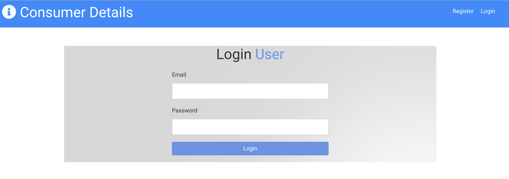

# Consumer Details

This application can be used to keep the details of both consumer and staffs on daily basis who ever enter the stores/venue. Once the user registered, user can login and enter the details of consumer and staffs.

# Contents

The application consists of 1 main file, server.js. The application has both front end and back end. Front end or user interface is made user friendly using React framework. Backend is done using node js. Data or inforation are saved in MongoDB atlas such that information can be retrieved whenever we need them. Application also contains html and css files.

# Usage

To use this application, git clone this repository. Once you have git cloned, run npm install on both client and main path to install the dependencies for the application which are:

- express
- config
- bcryptjs
- express-validator
- jsonwebtoken
- mongoose
- concurrently
- nodemon
- axios
- bootstrap
- react
- react-dom
- react-router-dom
- react-scripts
- react-tranhsition-group
- uuid

The application can be invoked with npm run dev which will run both front and back end concurrently.

# User Story

As business person and keeping in mind what's going in the world because of COVID-19, I want something to keep the details of information of all the customers and staffs such that those information can be used during COVID outbreak in the region.

# Link to the application

- Heroku Deployed link: (https://project-03-2021.herokuapp.com/)
- Github Repository Link: (https://github.com/ManNeu/Consumer-Details)

# Screenshots of the apps and database

# Built With

- VS Code (https:// code.visualstudio.com/)
- Terminal
- Express
- Node
- MongoDB
- React framework
- html
- css

# License

MIT License Copyright (c) 2021 ManNeu

Permission is hereby granted, free of charge, to any person obtaining a copy of this software and associated documentation files (the "Software"), to deal in the Software without restriction, including without limitation the rights to use, copy, modify, merge, publish, distribute, sublicense, and/or sell copies of the Software, and to permit persons to whom the Software is furnished to do so, subject to the following conditions:

The above copyright notice and this permission notice shall be included in all copies or substantial portions of the Software.

THE SOFTWARE IS PROVIDED "AS IS", WITHOUT WARRANTY OF ANY KIND, EXPRESS OR IMPLIED, INCLUDING BUT NOT LIMITED TO THE WARRANTIES OF MERCHANTABILITY, FITNESS FOR A PARTICULAR PURPOSE AND NONINFRINGEMENT. IN NO EVENT SHALL THE AUTHORS OR COPYRIGHT HOLDERS BE LIABLE FOR ANY CLAIM, DAMAGES OR OTHER LIABILITY, WHETHER IN AN ACTION OF CONTRACT, TORT OR OTHERWISE, ARISING FROM, OUT OF OR IN CONNECTION WITH THE SOFTWARE OR THE USE OR OTHER DEALINGS IN THE SOFTWARE.

# Author

Manish Neupane  
Email: mrnish.are@gmail.com  
Github: https://github.com/ManNeu
